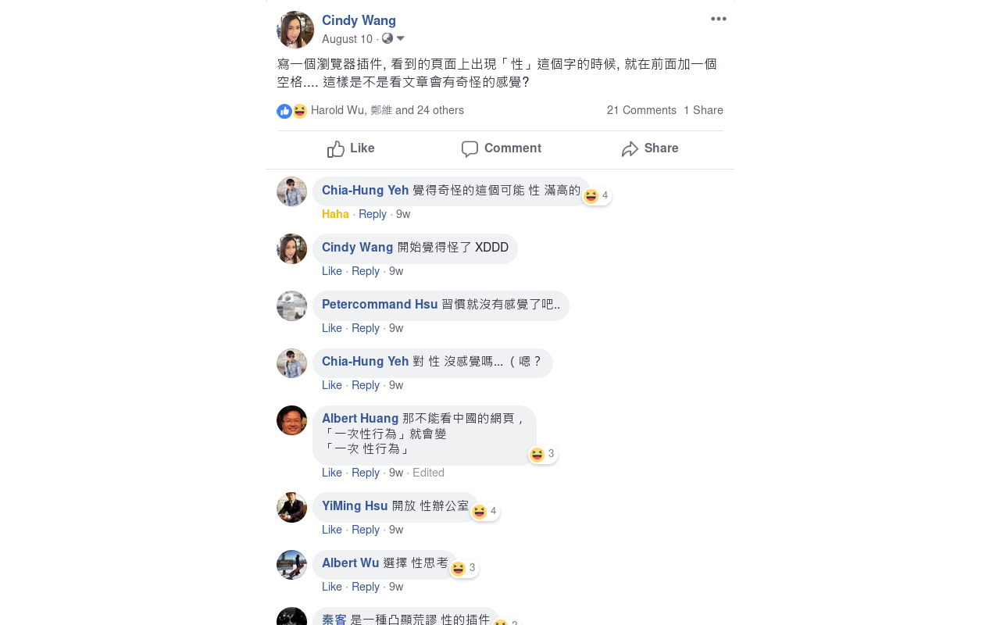

## 挪抬 性

這是一個在「性」字前面加上一個空格的 Chrome/Firefox extension。安裝後它會在你瀏覽的網頁裡每個「性」字前面加上一個空格，點按 extension 的 icon 可以切換關閉它。

Chrome 版本 [從 Chrome web store 安裝](https://chrome.google.com/webstore/detail/%E6%8C%AA%E6%8A%AC-%E6%80%A7/bfdgpbbjkbeoemaifpgappobhlmkfgmn)

Firefox 版本 [從 Mozilla add-on 安裝](https://addons.mozilla.org/en-US/firefox/addon/%E6%8C%AA%E6%8A%AC-%E6%80%A7/)

## 源起

寫一個瀏覽器插件, 看到的頁面上出現「性」這個字的時候, 就在前面加一個空格.... 這樣是不是看文章會有奇怪的感覺? [FB討論串](https://www.facebook.com/cindylinz/posts/10216996380322868)

我這週末第一次在發起與推廣「以核養綠」公投的核能流言終結者聊天室社團發文, 這次的經驗把我驚呆了.

我在文章裡說, 我覺得儘快補件比較好, 會被加入這次大選的機會很高, 並說明了我如此認為的理由. 幾分鐘之後, 黃士修提了一下那個離譜的陰謀論, 然後把我發的文截圖起來, 重新在社團裡發文並 tag 我說是惡意帶風向. 板眾也一起攻擊著, 他們去翻找我 FB 的舊文來截圖, 翻我的照片貼出來罵, 戰外貌說請找個正一點的再來發文. 他們的攻擊非常踴躍, 踴躍到 FB 後來有新留言都不再通知我了..

他們說我是綠蛆, 是長期臥底的反對者. 我表示我從來沒有反對過核能, 我沒有發文挺過, 是因為我自知還不夠理解, 我長期在這社團撿科普文看. 我覺得不好的都是推廣的方式: 像是絕食或是拒不補件, 還有竟然搞到藍綠政客都把這當票房毒藥. 他們批評我和郝明義的書合照, 我說那是馬政府的國策顧問, 我想知道他怎麼想 (雖然這書買了一直沒看w) 他們說, 現在無論我說什麼都不會有人信了.

這第一次的經驗非常心驚, 所以我決定把兩個月前發想的垃圾 extension 實作出來壓壓驚, 我原本真沒打算寫它的wwww
